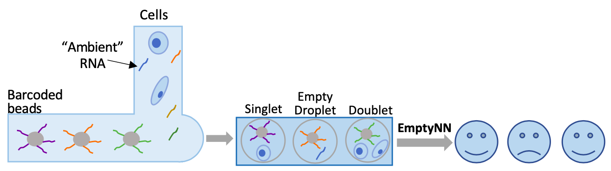

# EmptyNN
**EmptyNN** is a **Positive-unlabeled (PU) learning** based neural network approach to **remove empty droplets and recover lost cells** from droplet-based single cell RNA sequencing data.

<p align="center"> 

</p>

**Schematic diagram of EmptyNN**

## Installation
### option 1
```
$ git clone http://github.com/lkmklsmn/emptynn
$ cd emptynn
## enter R and install packages
$ R
> install.packages("EmptyNN_1.0.tar.gz", repos = NULL, type = "source")
```
### option 2
```
> install.packages("devtools")
> library(devtools)
> install_github("lkmklsmn/emptynn")
```
## Download example datasets
```
$ cd emptynn
$ Rscript "./code/download.data.R"
```
